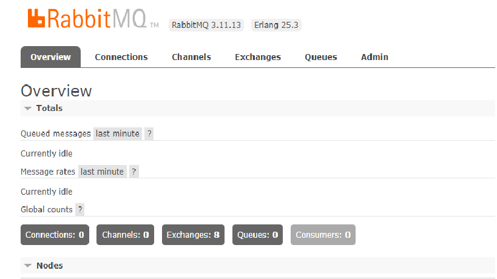
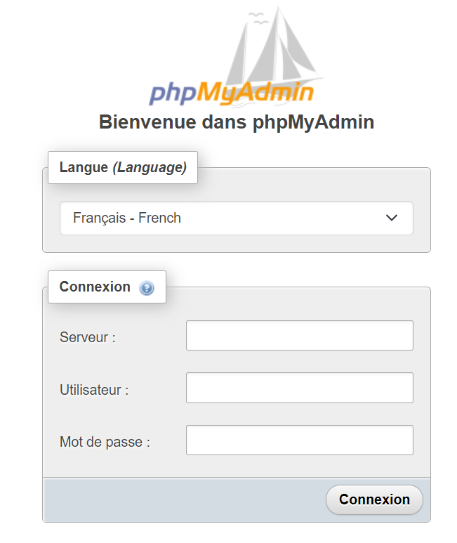

# RabbitMQ Data Streaming


# Préambule et Définiton
Le data streaming, également connu sous le nom de traitement en temps réel ou traitement de flux de données, est un modèle de traitement 
des données dans lequel les données sont traitées et analysées à mesure qu'elles sont générées ou reçues, plutôt que d'être stockées 
pour un traitement ultérieur. Le data streaming est couramment utilisé dans de nombreux domaines, notamment l'Internet des objets (IoT), 
l'analyse de données en temps réel, la surveillance des réseaux, la finance, la publicité en ligne, la sécurité et bien d'autres.

# Qu'est ce que RabbitMQ?
RabbitMQ est un logiciel de messagerie open source basé sur le protocole de messagerie avancée (Advanced Message Queuing Protocol ou AMQP).
Il utilise le modèle de messagerie basé sur la file d'attente, où les producteurs envoient des messages à des files d'attente, 
et les consommateurs récupèrent ces messages pour les traiter. Les files d'attente agissent comme des intermédiaires qui stockent temporairement 
les messages jusqu'à ce qu'ils soient consommés, permettant ainsi aux différents composants d'un système de communiquer de manière asynchrone 
et de gérer les pics de charge ou les défaillances de manière robuste. RabbitMQ offre de nombreuses fonctionnalités avancées telles que 
la gestion des priorités de messages, la gestion des erreurs et des reprises, la distribution de messages sur plusieurs consommateurs, 
la gestion des transactions, la sécurité, la gestion des routages et bien d'autres. Il est largement utilisé dans les architectures distribuées 
pour faciliter la communication et l'intégration entre les applications, les services ou les microservices, et est utilisé dans de nombreux domaines, 
notamment les systèmes de traitement des paiements, les applications de messagerie instantanée, les applications de suivi et de gestion des événements, 
les systèmes d'analyse de données en temps réel et bien d'autres.

# Le Projet
Le but du projet est de créer un producteur qui lira un fichier logs et les publiera sur un topic d'échange qui sera lié à deux files d'attente, appellées: 
"queue-data-lake" et "queue-data-clean". Chaque événement publié par le producteur de logs sera envoyé aux deux files d'attente. Dans ce cas, deux consommateurs seront créés pour consommer les événements de chaque file d'attente en transformant les journaux et en insérant les résultats dans une base de données à l'aide d'un ORM.

# consumer_Data_lake
Le "consumer_Data_lake" se connectera à une base de données MySql et insérera chaque ligne de logs en tant que nouvel enregistrement dans une table appelée "raw-log" 
à l'aide d'un ORM. Les informations seront stockées sous les détails suivants :
-> id: md5 hash of all the line log
-> timestamp: the time of the log with the timezone
-> log: all the log line.

# consumer_Data_Clean
Le "consumer_Data_Clean" se connectera à une base de données MySql et insérera chaque ligne de logs en tant que nouvel enregistrement dans une table appelée "clean-log" à l'aide d'un ORM. Les informations seront stockées comme l'indique l'exemple suivant :
log: 181.58.38.180 YWN6Z2YRMwbb1KF elizabeth.usugal@crypto.com [01/Mar/2023:00:00:09 -0500] 
"GET https://app.knovel.com:443/api/entitlements/get-license?post={"APIKEY"%3A"EE109DAC-756e-009d-1611-76371a443ed6"} HTTP/1.1" 200 1386 -
Le resultat sorti:
-  id: md5 hash of all the line log;
-  timestamp: 01/Mar/2023:05:00:09
-  year: 2023
-  month: 3
-  day: 1
-  day_of_week: Tuesday
-  time: 05:00:09
-  ip: 181.58.38.180
-  country: Colombia
-  city: Armenia
-  session: prFte8oL9YoPOLS
-  user: nicolle.lopez@cypto.com
-  is_email: True
-  email_domain: @cypto.com
-  rest_method: GET
-  url: https://app.knovel.com:443/api/entitlements/get-license?post={"APIKEY"%3A"EE109DAC-756e-009d-1611-76371a443ed6"}
-  schema: https
-  host: app.knovel.com
-  rest_version: HTTP/1.1
-  status: 200
-  status_verbose: Ok 
-  size_bytes: 1386
-  size_kilo_bytes: 1.386
-  size_mega_bytes: 0.001386

# Prérequis
Python 3.7 ou supérieur, 
RabbitMQ 3.11 avec le plugin de gestion activé, 
MySQL 5.7 ou supérieur, 
Accès root au serveur

# Installation
1. Cloner le projet
```
git clone https://github.com/Kyleris/Data-Streaming.git
```
2. Dupliquer le fichier .env.example et le nommer .env, modifier son contenu pour lui attribuer les valeurs suivantes:
RABBIT_USER="....."
RABBIT_PASSWORD="....."
DB_NAME="....."
DB_USER="....."
DB_PASSWORD="......"
DB_ROOT_PASSWORD="....."
3. Création des instances respectivement pour RabbitMQ et MySql avec la commande:
```
docker-compose --env-file .env -f docker-compose.yml -p data-stream up -d
```

Cela lancera deux conteneurs Docker : un pour RabbitMQ et un pour MySQL. On peut accéder au serveur RabbitMQ 
en allant sur http://localhost:15672 et en se connectant avec les informations d'identification spécifiées dans .env, 
pour le serveur MySql on peut se connecter en utilisant le serveur web phpMyAdmin à l'adresse http://localhost:8080.





4. Création d'un environement virtuel et installation des dependences du fichier requirementses.txt avec la commande:
```
python -m venv venv
.\venv\Scripts\activate
pip install -r requirements.txt
```

# Lançant le producer et les consommateurs RabbitMQ

Pour lancer le logs_producer, on éxécute la commande suivante:
```
python logs_producer.py
```

Cela enverra un message aux files d'attente 'queue-data-clean' et 'queue-data-lake'. On peut toujours modifier le nom de la file d'attente selon nos besoins.

Pour lancer les consommateurs RabbitMQ, on exécute les commandes suivantes :
```
python consumer_data_clean.py
```
```
python consumer_data_lake.py
```
Ces commandes lanceront deux consommateurs RabbitMQ qui écouteront les files d'attente 'queue-data-clean' et 'queue-data-lake' respectivement et qui consomment les messages reçus sur chaque fille d'attente.


